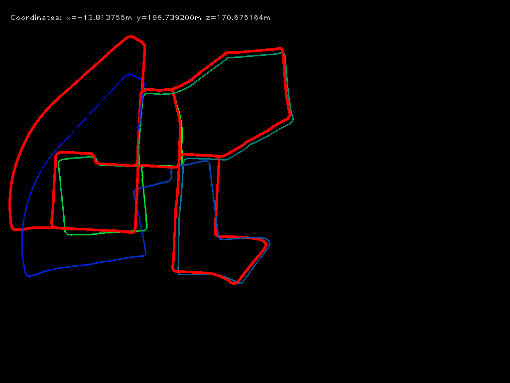

## Dataset
---
[KITTI Odometry Dataset](http://www.cvlibs.net/datasets/kitti/eval_odometry.php)


## Usage
---
Modify the paths for image sequence and ground truth in `main.py`, then run
```python
python main.py
```